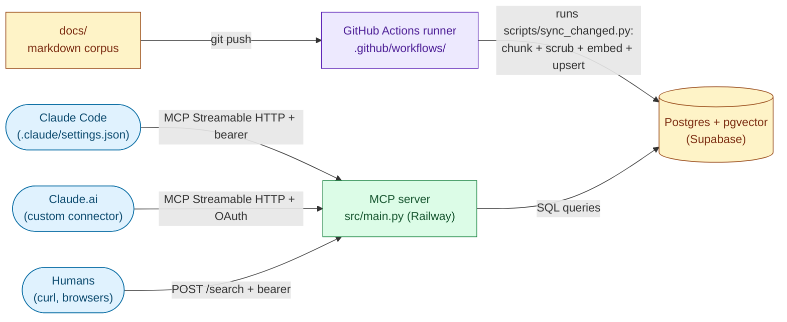

# Architecture

How the knowledge-layer system is put together, and how the pieces fit when a fork is deployed. Aimed at someone who has cloned the repo, read the README, and now needs to operate it.

For the rationale behind individual choices (why Postgres + pgvector, why monorepo, why a hosted MCP server), read the `*-dec-*.md` files under `docs/`. This file describes what is, not why.

## System diagram, the five components and the data flow

Five components: the markdown corpus under `docs/`, the indexer code under `scripts/`, the Postgres + pgvector database, the MCP server under `src/`, and the clients that connect to it. Arrows show who initiates each call.



## The corpus, what lives under docs/

`docs/` is a directory of markdown files. Each file has YAML frontmatter declaring identity (`file`, `area`, `area-name`, `type`, `title`), lifecycle (`status`, `date`), and the dependency graph (`depends-on`, `feeds-into`, `also-touches`, `supersedes`). The shape of the frontmatter is enforced by `scripts/audit_docs_standards.py`; the prose rules (section summaries, inlined cross-references, one concept per section, concrete searchable terms) are described in `docs/00-fwk-writing-guide.md`.

Filenames follow `[area]-[type]-[name].md`. Six controlled doc types: `spec`, `res`, `str`, `dec`, `pol`, `fwk`. The audit script enforces this pattern.

`docs/TEMPLATES/` contains one scaffold per doc type for authors to copy from.

## The indexer, scripts/ + rag_core/

The indexer reads markdown files, chunks them at `##` headers (4000-character cap, with a paragraph-and-word-aware fallback for oversize sections), redacts values for fields in the project's exclusion list, embeds each chunk with OpenAI `text-embedding-3-small` (1536 dimensions), and upserts into Postgres. The shared pipeline lives in `scripts/rag_core/`. The non-obvious modules:

- `scrub.py`, redacts the values of fields named in `EXCLUDED_FIELDS` (project-defined; the template ships with the list empty so a fresh fork has no surprises).
- `upsert.py`, the single writer for `doc_chunks`; uses content hash to skip unchanged sections.
- `relationships.py`, writes the frontmatter graph to `doc_relationships`.
- `outline.py`, writes per-doc section trees to `doc_outlines` for `get_doc_outline` to read back.
- `sync.py`, the orchestrator that diffs the input set against the database and writes only what changed.
- `html_tracker.py`, parses the project tracker HTML page (a JavaScript array literal embedded in HTML by `docs/00-fwk-project-tracker.md`'s build step) so the tracker is searchable alongside markdown.

Two entry points use the pipeline:

- `scripts/populate.py`, full or filtered reindex from a local checkout. Run with `--full-reindex` to rebuild the corpus from scratch.
- `scripts/sync_changed.py`, incremental sync driven by a git diff. The `sync-to-rag.yml` workflow calls this on every push.

`scripts/build_decision_registry.py` is a separate pipeline that populates the `decisions` table from `*-dec-*.md` frontmatter. It runs in the same workflow as the chunk indexer, but only when a `*-dec-*.md` file changed.

## The database, five tables in Postgres + pgvector

The database holds the indexed chunks, the per-doc section trees, the dependency graph, the decision registry, and a query log. Schema is one self-contained migration at `scripts/migrations/001_schema.sql`.

| Table | Purpose | Populated by |
|-------|---------|--------------|
| `doc_chunks` | One row per `##` section. Holds `content`, `embedding vector(1536)`, `tsv tsvector`, authority fields (`status`, `supersedes`, `doc_date`), provenance (`git_sha`, `git_committed_at`), and the per-chunk graph edges. | `scripts/rag_core/upsert.py` |
| `doc_outlines` | One row per doc. Holds the section tree as JSONB. | `scripts/rag_core/outline.py` |
| `doc_relationships` | One row per directed edge (`source_file`, `relation`, `target`). `relation` is one of `depends_on`, `feeds_into`, `also_touches`, `supersedes` (underscored at the database layer; hyphenated in the YAML frontmatter). | `scripts/rag_core/relationships.py` |
| `decisions` | One row per settled decision. Holds `decision_key`, `current_value`, `source_doc`, supersession chain. | `scripts/build_decision_registry.py` |
| `query_log` | One row per `search_docs` call: scrubbed query, top-k IDs, latency, caller. Telemetry only; no retention policy in the schema, prune manually if it grows. | `src/search.py` on every call |

Indexes:

- `doc_chunks_embedding_idx`, ivfflat on `embedding` with `lists = 100` (the default targets ~100k chunks; for larger corpora, `lists ≈ rows / 1000`).
- `doc_chunks_tsv_idx`, GIN on `tsv` for the lexical half of hybrid search.
- Partial indexes on `status` and `area_number` for filtered queries.

Row Level Security is enabled on all five tables with no policies. The MCP server and indexer both connect with the service-role key, which bypasses RLS. Enabling RLS without policies blocks any other PostgREST client from reading the tables, which is the safer default for a project with no legitimate anon-key caller.

## The MCP server, src/main.py

A FastAPI application that hosts a FastMCP app. FastMCP provides the seven MCP tools over the Streamable HTTP transport at `/mcp`; FastAPI provides the surrounding HTTP surface (a REST `/search` endpoint, the OAuth endpoints, `/health`, and the auth middleware).

Module map:

- `src/main.py`, the FastMCP app, the seven tool registrations, the REST `POST /search` endpoint, the OAuth endpoints (`/.well-known/oauth-authorization-server`, `/.well-known/oauth-protected-resource`, `/authorize`, `/token`), `/health`, and the `mcp_auth_middleware` that gates every request under `/mcp`, `/sse`, or `/messages`.
- `src/auth.py`, `verify_token` and `require_auth`. The middleware calls `verify_token` directly; `require_auth` is used by the REST `/search` endpoint.
- `src/db.py`, the `psycopg2.pool.ThreadedConnectionPool` shared by every tool.
- `src/search.py`, `search_docs` and `check_index_health`, with hybrid lexical + vector ranking via `tsvector` and pgvector cosine. Writes one row to `query_log` per call.
- `src/decisions.py`, `get_decision` and `get_impact_targets`, traversing the `decisions` table and the dependency graph.
- `src/neighborhood.py`, `get_doc_neighborhood`, traversing `doc_relationships`.
- `src/outline.py`, `get_doc_outline`, reading the cached JSON section tree.
- `src/drift.py`, `get_drift_report`, surfacing the queue produced by `scripts/detect_drift.py`.

Every tool result includes provenance columns from `doc_chunks` (`git_sha`, `git_committed_at`, `source_file`, `status`) so a caller can quote, cite, or refuse to act based on the answer's authority and recency.

## The clients, how Claude Code and Claude.ai connect

Two client modes, each with its own configuration mechanism. Auth details are in the Authentication section below.

**Claude Code (per-repo).** A clone's `.claude/settings.json` registers the MCP server URL and a bearer token in the `mcpServers` block. Claude Code reads this at session start and connects automatically. The repo's `CLAUDE.md` is read at the same moment and applied as a project-level constraint sheet.

**Claude.ai (custom connector).** A user adds the MCP server URL as a custom connector in their Claude.ai settings. The OAuth flow at `src/main.py` issues a bearer token after the redirect flow completes; the token is then sent on every MCP request.

A third path is the REST `POST /search` endpoint for non-MCP callers (curl scripts, internal tools). Same bearer-token auth; results are JSON.

## CI workflows, three workflows under .github/workflows/

Three workflows: doc audit on PR and push, incremental index sync on push, manual full reindex.

| Workflow | Trigger | What it does |
|----------|---------|--------------|
| `audit-docs.yml` | PR or push to main on `docs/**` paths | Runs `scripts/scrub_test.py` to verify the governance scrub still redacts the expected fields, then runs `scripts/audit_docs_standards.py`, parses the report, and fails the run if violations exceed the hard-coded `allowed = 0` threshold |
| `sync-to-rag.yml` | Push to main on `docs/**` paths | Runs `scripts/sync_changed.py` against the production database to upsert only the changed chunks. If any `*-dec-*.md` file changed, also rebuilds the `decisions` table via `scripts/build_decision_registry.py` |
| `reindex.yml` | Manual dispatch with a `confirm: REINDEX` input gate | Runs `scripts/populate.py --full-reindex` to rebuild every chunk from scratch, then runs `verify_scrub.py`, `verify_schema_fields.py`, and `build_decision_registry.py`. Used after migrations, scrub-list changes, or embedding-model swaps |

All three pin Python 3.12.

## Deployment topology, where each piece runs

What each component runs on in the QUICKSTART setup, and what it can substitute for.

| Component | Where it runs | Provisioned by |
|-----------|---------------|----------------|
| `docs/` corpus | GitHub repository | git |
| Indexer | GitHub Actions runner | `.github/workflows/sync-to-rag.yml` and `reindex.yml` |
| Database | Supabase managed Postgres | `scripts/migrations/001_schema.sql` run via the Supabase SQL editor or psql |
| MCP server | Railway service from `Procfile` | Railway, `requirements.txt`, environment variables |

The `Procfile` runs:

```
web: uvicorn src.main:app --host 0.0.0.0 --port $PORT --workers 1 --timeout-graceful-shutdown 30
```

The `--workers 1` pin is load-bearing: FastMCP's session manager keeps per-session state in process memory, so multiple workers would split sessions across processes and break Streamable HTTP continuity.

Environment variables required at runtime (server):

- `DATABASE_URL`, Supabase connection string.
- `OPENAI_API_KEY`, OpenAI key for embedding searches.
- `MCP_TOKEN_1` through `MCP_TOKEN_9`, up to nine bearer tokens. Each variable holds one token; the server accepts any that match. Multiple tokens enable per-user revocation.
- `BASE_URL`, the public URL of the Railway service. Required only if you expose the connector to Claude.ai (used in the OAuth discovery metadata). Claude Code clients use bearer auth directly and do not need it.
- `OAUTH_EXTRA_REDIRECT_HOSTS` (optional), comma-separated hostnames to extend the OAuth `redirect_uri` allowlist beyond the built-in defaults.

The same `DATABASE_URL` and `OPENAI_API_KEY` are configured as GitHub Actions secrets for the indexer to use.

Alternative substrates work: any Postgres + pgvector instance for the database, any ASGI-capable runtime for the server. The choices documented here are the ones in QUICKSTART.

## Authentication, how the MCP server gates access

The MCP server has no anonymous access. Two routes in, both backed by the same bearer-token list.

**Bearer tokens.** The server reads up to nine tokens from `MCP_TOKEN_1` through `MCP_TOKEN_9`. The client (Claude Code via `.claude/settings.json`, curl, or any other HTTP client) sends a valid token as `Authorization: Bearer <token>` on every request. Token validation runs in a FastAPI middleware (`mcp_auth_middleware` in `src/main.py`) that calls `verify_token` (`src/auth.py`) for any request whose path starts with `/mcp`, `/sse`, or `/messages`. The REST `/search` endpoint is protected by `require_auth` called directly inside the handler.

**OAuth bridge.** The OAuth endpoints in `src/main.py` wrap the same token list so Claude.ai's custom-connector flow can complete the redirect flow and receive a bearer token to use on subsequent requests. The `redirect_uri`'s host is validated against an allowlist (`_DEFAULT_REDIRECT_HOSTS` in `src/main.py`, extendable via the `OAUTH_EXTRA_REDIRECT_HOSTS` env var) to block open-redirect abuse.

There is no per-user identity or per-user permission model. A token gates access to the entire indexed corpus; whoever holds the token can read every chunk. Per-user tokens (separate `MCP_TOKEN_N` values per user) are the unit of revocation.

## What this file does not cover

- Why these choices were made. See the `*-dec-*.md` files under `docs/` for rationale (`03-dec-tech-stack.md` for the substrate choices, others for narrower decisions).
- How to write good documents for vector retrieval. See `methodology.md` and `docs/00-fwk-writing-guide.md`.
- How to operate the hygiene loop. See `docs/00-fwk-doc-hygiene-loop.md`.
- How to set up a fresh fork end-to-end. See `QUICKSTART.md`.
- The eval harness. See `evals/README.md`.
