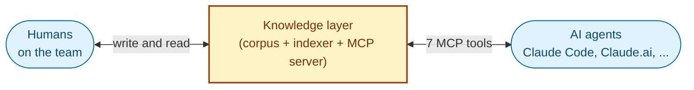
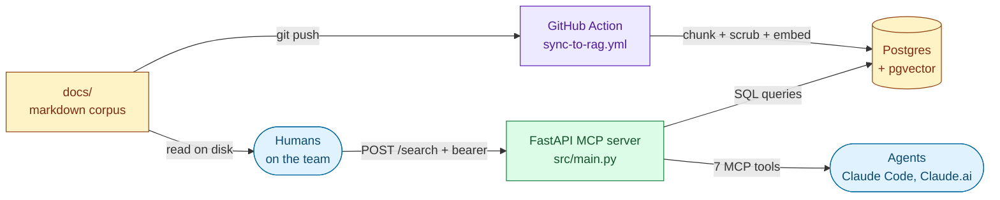
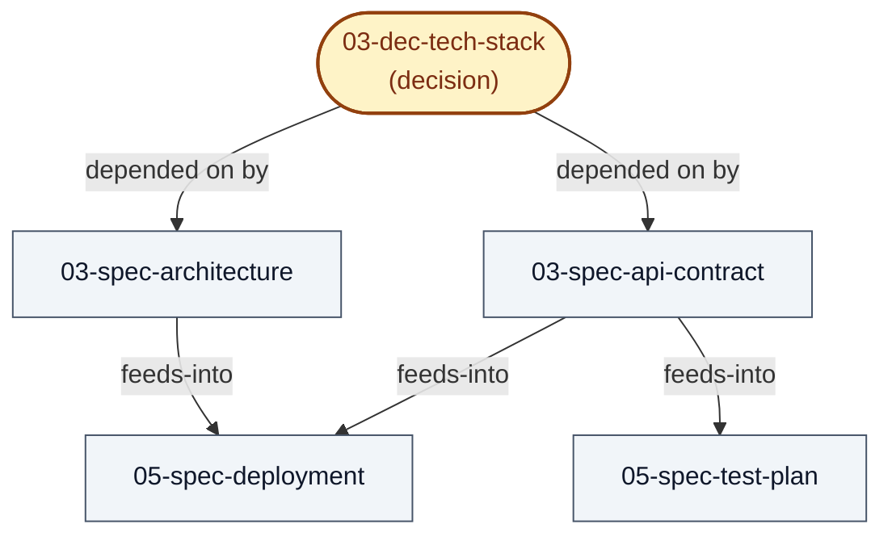
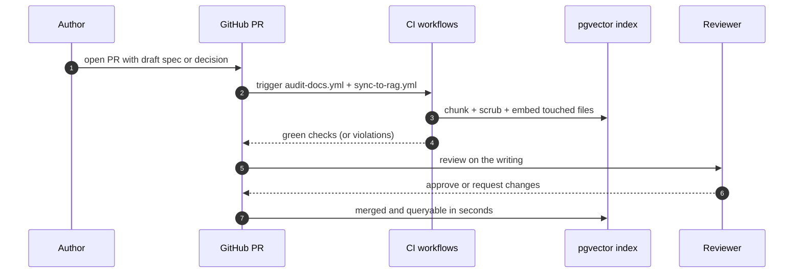
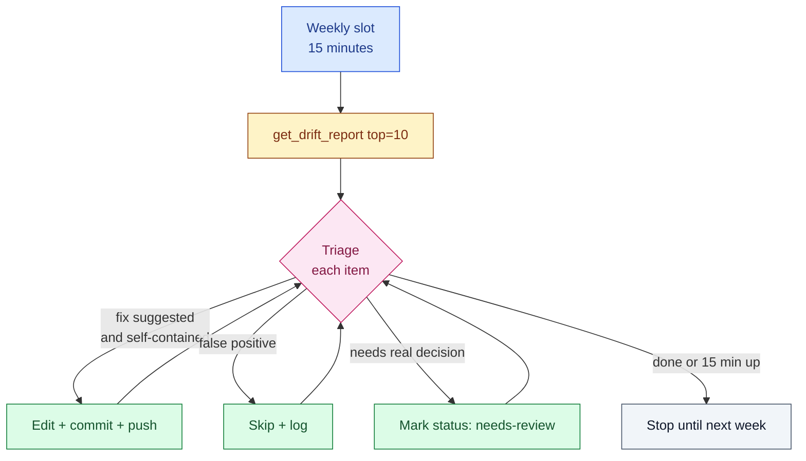

# Knowledge layer for AI-native teams

**[Architecture](ARCHITECTURE.md)** · **[Quickstart](QUICKSTART.md)** · **[Contributing](CONTRIBUTING.md)** · **[Methodology](methodology.md)** · **[Writing guide](docs/00-fwk-writing-guide.md)**

> Your team's memory, made queryable by both humans and agents. A write-first methodology, a reference implementation, and a forkable starting point.

A *knowledge layer* is a single, agent-readable substrate that underlies product, engineering, design, and operations work. It serves two populations through the same interface: the humans on the team (who write the documents and read them back), and the agents that execute work on the team's behalf (Claude Code, Claude.ai, or any other MCP-aware client). Both ask the same questions of the same store; both get the same answers, grounded in the team's settled truth rather than in training data, the public web, or the last few messages in a chat window.

The methodology that produces the substrate is **write-first**: every spec, decision, and policy is written down before it is acted on. The layer is the artefact that makes those writings useful to machines as well as to people.

This repository is the reference implementation. It ships the indexer, the MCP server, the per-PR audits, and the document standards. Everything except the corpus. The corpus is yours to write.

---

## The shift that makes this necessary

For roughly two years, the dominant pattern for connecting an LLM to a team's own knowledge has been *retrieval-augmented generation*: embed documents into a vector store, fetch the top-k chunks at query time, stuff them into the prompt. RAG is fine for a chatbot answering questions over a static FAQ. It is a poor foundation for AI agents executing real work.

A cluster of recent work converges on the same diagnosis. Nate Jones [[1]](#citations) and Pinecone [[2]](#citations) reframe retrieval for agents as a *knowledge layer* or *knowledge engine* with first-class authority and supersession. Microsoft's GraphRAG [[3]](#citations) adds an entity-and-relationship graph over the corpus to address cross-document "connecting the dots" weakness; VectifyAI's PageIndex [[4]](#citations) preserves the intra-document section structure that uniform chunking destroys. Harrison Chase [[5]](#citations) names context engineering as the central skill. Barnett et al.'s *Seven Failure Points* [[6]](#citations) and Ru et al.'s *RAGChecker* [[7]](#citations) add the operational discipline (failure taxonomies, diagnostic metrics); AWS's prescriptive guidance for RAG documentation [[8]](#citations) adds the writing-side conventions. Together they establish that a serious knowledge layer cannot be designed-in once: it needs its own diagnostic loop and its own writing rules.

This repository is one concrete embodiment of that direction.

---

## What this repository is

A single tree holding four things:

1. **The corpus.** A `docs/` directory of markdown documents (specs, decisions, policies, frameworks, strategies, research notes), each with YAML frontmatter declaring its identity, lifecycle state, and dependency edges. The corpus is the source of truth. If a fact is not in the corpus, the system does not know it. This repository ships document **standards** and **templates**, not your corpus content. That part is yours.

2. **The indexer.** A `scripts/` directory plus the shared `rag_core/` package: a Python pipeline that parses each document, chunks it while preserving section structure, scrubs fields that must never leave the team's boundary, embeds the chunks with an off-the-shelf model, and upserts into Postgres + pgvector. The indexer runs in CI on every push.

3. **The MCP server.** A `src/` FastAPI application that exposes seven tools over the MCP Streamable HTTP transport. Any MCP-aware client (Claude Code, Claude.ai, or other agents) connects and calls the tools. Humans access the same corpus directly through the doc files on disk and through any docs site built on top of them.

4. **Worked examples.** At least one end-to-end example per doc type under `docs/`: `01-str-knowledge-strategy.md` (strategy), `02-spec-onboarding-flow.md` and `03-spec-search-api.md` (spec), `03-dec-tech-stack.md` (decision), `03-res-vector-stores.md` (research), `05-pol-data-retention.md` (policy), and the framework docs at `docs/00-fwk-*.md`. Plus `examples/CLAUDE.example.md` (a populated `CLAUDE.md` skeleton) and `examples/sample-docs/` (a before/after pair showing the writing rules applied).

The corpus, the indexer, and the server live in the same repository on purpose. Documents, the code that indexes them, and the code that serves them evolve together. One tree, one history, one PR.

---

## The seven tools

| Tool | What it answers |
|---|---|
| `search_docs` | "Find me everything in our knowledge about X." Hybrid vector + lexical search across the corpus with filters on `status`, `area`, and `doc_type`. Superseded documents are excluded by default. When explicitly included they return with a `[SUPERSEDED, see <target>]` banner so the caller does not silently act on a retired claim. |
| `get_decision` | "What is our settled position on X?" Looks up a decision by id, key, or fuzzy text and returns it with a `[CURRENT]`, `[SUPERSEDED]`, or `[DRAFT]` banner. The banner is load-bearing: it tells the caller whether the answer it is about to act on is still in force. |
| `get_impact_targets` | "If I change X, what else has to change?" Given a decision or a document, walks the dependency graph and returns every other document that declares a dependency, plus a configurable cascade up to three hops. |
| `get_doc_neighborhood` | "What does this document touch, and what touches it?" Declared outgoing edges (`depends-on`, `feeds-into`, `supersedes`), inverse incoming edges, the supersession chain, and warnings for dangling references. |
| `get_doc_outline` | "Give me the section tree of this long document so I can navigate it without grepping the body." Headers at levels 1 through 3 with anchors and character ranges so a caller can fetch a specific section by slice rather than re-reading the whole file. |
| `get_drift_report` | "What in our knowledge has gone stale?" A prioritised queue of flagged items across four signals: retired strings, dangling references, dependency targets edited more recently than the depending document, and chunks whose prose contradicts a current decision. |
| `check_index_health` | "Is the index in good shape?" Per-file chunk counts and staleness flags. |

Every result carries provenance (`git_sha`, `git_committed_at`, `source_file`, `status`) so the caller (human reviewer or agent) can quote, cite, or refuse to act based on the answer's authority and recency.

A call like `get_impact_targets("03-dec-tech-stack")` returns the decision plus every doc that depends on it, walked through the frontmatter graph:

---

## Write-first methodology

Write-first means: before any meaningful change to product, code, or operations, the change is written down. In the corpus, with frontmatter, with dependencies declared, in a pull request that the rest of the team can review. The writing is the work. The code is a side-effect.

A typical change goes:

1. A teammate (or an agent working on their behalf) drafts a spec or decision. It enters the corpus as `status: draft` with whatever dependencies it declares.
2. The PR triggers `audit-docs.yml` (validates frontmatter, resolves references, checks section sizes, runs the scrub fixture test) and `sync-to-rag.yml` (incrementally re-indexes just the touched files).
3. Review and merge happen on the writing. Code that implements the change comes later, sometimes via a separate PR, sometimes by an agent told to "implement the spec at `<filename>`."
4. When a decision changes, the next caller asking `get_impact_targets` finds every dependent document and either updates them in the same PR or files follow-ups. Documents that are no longer current get `status: superseded` and a `supersedes` pointer to their replacement. They stay searchable but with a banner.

---

## How it is maintained

A knowledge layer that is not maintained becomes a graveyard of stale claims. Five mechanisms keep the corpus honest:

1. **Per-PR governance.** `audit-docs.yml` validates frontmatter, resolves references, checks section sizes, runs the scrub fixture test. A PR that breaks the standards cannot merge (with branch protection configured).
2. **Incremental re-index on every push.** `sync-to-rag.yml` reindexes only the changed files. New documents are queryable within seconds of merge.
3. **Manual full re-index.** `reindex.yml` (workflow-dispatch) wipes the index and rebuilds it. Used when chunking logic, the embedding model, or the scrub list changes. Two verifier steps (scrub + field coverage) and a decision-registry rebuild run after.
4. **The drift report and the weekly hygiene loop.** Once a week, an owner runs `get_drift_report(top=10)` and triages the top items. Each item arrives with the file, line, signal, reason, authoritative source, and suggested replacement. See [`docs/00-fwk-doc-hygiene-loop.md`](docs/00-fwk-doc-hygiene-loop.md).
5. **The decisions registry.** `scripts/build_decision_registry.py` parses `decisions:` blocks from `*-dec-*.md` frontmatter into the `decisions` table. `get_decision` reads from it; the drift detector compares prose against it.

The weekly hygiene loop is the one human step that holds the rest together:

---

## What this is not

This is not a chatbot. It is not a "talk to your docs" interface bolted onto a Notion export. It is not a vector store with a search box. It is not a workflow engine, a CMS, or a wiki replacement.

It is not "fully agentic" in any breathless sense of the word. Most maintenance operations (the weekly hygiene triage, the full re-index, the resolution of drift flags) are triggered by a human. The agents do the writing, the searching, and the impact reasoning. The human does the deciding. That balance is the point.

The template has been operated by a one- or two-person team; multi-team forks are untested.

It is a pattern, an opinion, and a working reference implementation that any team can fork.

---

## Getting started

See [QUICKSTART.md](QUICKSTART.md) for the full setup walkthrough (Supabase + pgvector, OpenAI, Railway, the schema migration, CI secrets, and your first document).

---

## License

MIT, see [LICENSE](LICENSE).

---

## Citations

1. Nate B. Jones, *RAG for AI Agents: Knowledge Layer Architecture Guide*, Nate's Substack, 2025. <https://natesnewsletter.substack.com/p/rag-agents-knowledge-layer-architecture>
2. Pinecone, *Pinecone Nexus: The Knowledge Engine for Agents*, May 2026. <https://www.pinecone.io/blog/knowledge-infrastructure-for-agents/>
3. Microsoft Research, *GraphRAG: Unlocking LLM discovery on narrative private data*, 13 February 2024. <https://www.microsoft.com/en-us/research/blog/graphrag-unlocking-llm-discovery-on-narrative-private-data/>
4. VectifyAI, *PageIndex: Document Index for Vectorless, Reasoning-based RAG*, September 2025. <https://github.com/VectifyAI/PageIndex>
5. Harrison Chase, *The Rise of Context Engineering*, LangChain blog, 23 June 2025. <https://blog.langchain.com/the-rise-of-context-engineering/>
6. Scott Barnett, Stefanus Kurniawan, Srikanth Thudumu, Zach Brannelly, Mohamed Abdelrazek, *Seven Failure Points When Engineering a Retrieval Augmented Generation System*, CAIN 2024 / arXiv:2401.05856, January 2024. <https://arxiv.org/abs/2401.05856>
7. Ru et al. (Amazon Science), *RAGChecker: A Fine-grained Framework for Diagnosing Retrieval-Augmented Generation*, NeurIPS 2024 Datasets and Benchmarks Track. <https://arxiv.org/abs/2408.08067>
8. Amazon Web Services, *Documentation best practices for RAG applications*, AWS Prescriptive Guidance. <https://docs.aws.amazon.com/prescriptive-guidance/latest/writing-best-practices-rag/best-practices.html>
