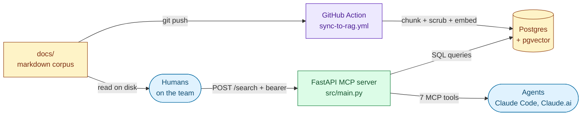
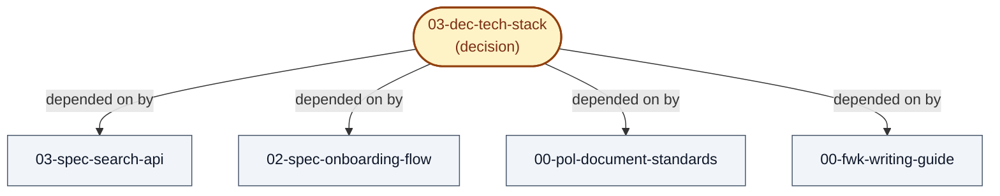
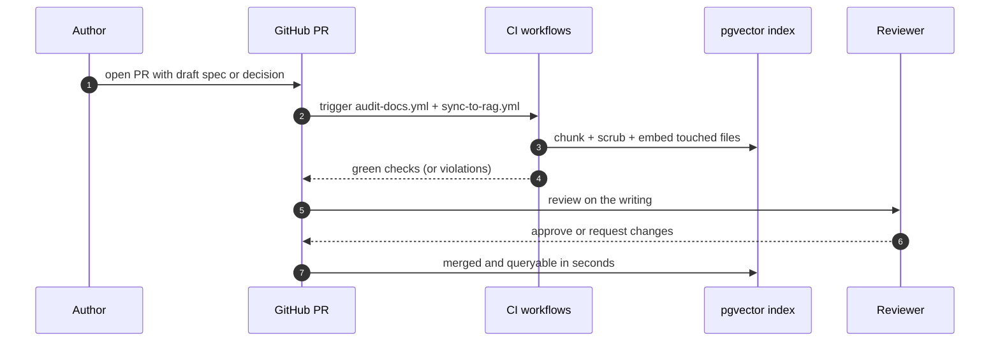
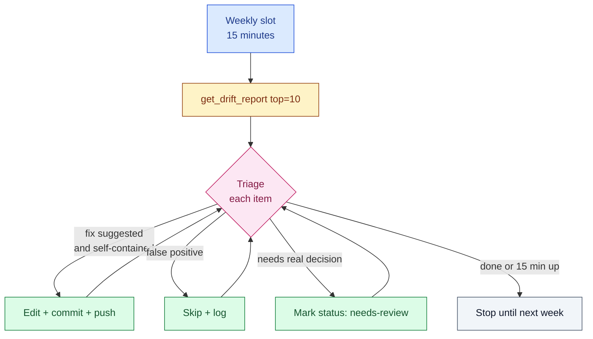

# Knowledge layer for AI-native teams

**[Architecture](ARCHITECTURE.md)** · **[Quickstart](QUICKSTART.md)** · **[Adoption](ADOPTION.md)** · **[Contributing](CONTRIBUTING.md)** · **[Method](methodology.md)** · **[Writing guide](docs/00-fwk-writing-guide.md)**

> Your team's memory, made queryable by both humans and agents. A write-first method, a reference implementation, and a forkable starting point.

A *knowledge layer* is a single, agent-readable substrate that underlies product, engineering, design, and operations work. It serves two populations through the same interface: the humans on the team (who write the documents and read them back), and the agents that execute work on the team's behalf (Claude Code, Claude.ai, or any other MCP-aware client). Both ask the same questions of the same store; both get the same answers, grounded in the team's settled truth rather than in training data, the public web, or the last few messages in a chat window.

The method that produces the substrate is **write-first**: every spec, decision, and policy is written down before it's acted on. The layer is the artefact that makes those writings useful to machines as well as to people.

This repository is the reference implementation. It ships the indexer, the MCP server, the per-PR audits, and the document standards. Everything except the corpus. The corpus is yours to write.

---

## Agents break on the ambiguity humans tolerated

For a decade the default in software delivery was code-first: talk through the change, write the code, document selectively, move on. The docs that existed were for onboarding, compliance, or sales; they lagged the code and contradicted it, so nobody trusted them and nobody updated them. That was survivable because the readers were humans, and humans tolerate ambiguity. A new engineer read what existed and then asked whoever had been there longest. The real transfer happened in conversation, and the documents were scaffolding.

Three things ended that. Agents now do the work the ambiguity-tolerant humans used to do, and they tolerate ambiguity badly: a vague spec produces confident, vague code, and an agent that can't tell which decision is current will act on one that was overturned six months ago. The cost of writing has collapsed, because an agent that knows your standards and your prior decisions drafts a usable spec in minutes. And the cost of *not* writing has risen, because vague input now returns vague output at high speed and high token cost.

The documents stop being scaffolding and become the substrate.

---

## RAG was built for chatbots, not agents

From 2023 to 2025, the dominant pattern for connecting an LLM to a team's own knowledge was naive *retrieval-augmented generation*: embed documents into a vector store, fetch the top-k chunks at query time, stuff them into the prompt. That design was built for chatbots answering questions, not for agents acting on a team's behalf. The shift from chatbot to agent broke its central assumption, that the retrieval system could stay silent about authority.

A cluster of recent work, from different vantage points, is converging on the same point.

Pinecone's announcement of **Pinecone Nexus** [[1]](#citations) (May 2026) calls it a *knowledge engine for agents* and reframes the work as *compilation* rather than retrieval: documents have status, history, and relationships to each other; artefacts are versioned and traceable to their sources; conflicts between documents resolve deterministically rather than by whichever chunk happened to rank higher. That this comes from one of the infrastructure companies that built the previous era of RAG is itself the signal.

The research arrives at the same place from a different angle. Microsoft's **GraphRAG** [[2]](#citations) (February 2024) built an entity-and-relationship graph over the corpus because vector similarity over disconnected chunks can't traverse the shared attributes that connect information across documents, nor hold a concept that spans a large collection. VectifyAI's **PageIndex** [[3]](#citations) (September 2025) preserved the intra-document section structure that uniform chunking destroys, organising each document into its natural table-of-contents tree rather than artificial fixed-size pieces. Both are admissions that retrieval has to respect the structure the writing put there, not just the text the chunker can split.

Barnett et al.'s **Seven Failure Points When Engineering a RAG System** [[4]](#citations) (CAIN 2024) catalogued how these systems break in production: Missing Content, Missed the Top Ranked Documents, Not in Context, Not Extracted, Wrong Format, Incorrect Specificity, and Incomplete. Two of them are directly about whether the right material exists in the corpus and ranks well; several others are downstream consequences of poorly written or poorly structured source documents. **RAGChecker** [[5]](#citations) (Ru et al., NeurIPS 2024) put numbers behind the picture: across eight RAG systems on ten domains, stronger retrievers drove consistent gains in overall F1 and claim recall, but better retrieval also raised the generator's sensitivity to noise, because the chunks then carried more irrelevant content alongside the relevant facts. Retrieval quality and source quality are tightly coupled. You can't paper over poorly written documents by tuning the retriever harder, and you can't tune the retriever harder without caring about what the chunks contain.

Harrison Chase at LangChain [[6]](#citations) (June 2025) names the corresponding skill: *context engineering*, building dynamic systems that supply the right information, tools, and format so the model can plausibly accomplish the task. The work of building agentic systems is increasingly curation rather than model selection. The model is a commodity; the context is the differentiator.

The thesis they converge on: a team that wants AI agents to do useful work on its behalf needs a substrate, and the substrate is a written corpus with structure, status, and dependency information. The corpus has to be maintained, the maintenance has to be cheap enough to actually happen, and the writing itself, ahead of the retrieval, is where the leverage is. The retrieval substrate is still RAG-shaped; what's changed is the way of working around it.

This repository is one concrete embodiment of that direction.

---

## Corpus, indexer, and server in one tree

Everything the system needs lives in one git repository:

1. **The corpus.** A `docs/` directory of markdown documents (specs, decisions, policies, frameworks, strategies, research notes), each with YAML frontmatter declaring its identity, lifecycle state, and dependency edges. The corpus is the source of truth. If a fact isn't in the corpus, the system doesn't know it. This repository ships document **standards** and **templates**, not your corpus content. That part is yours.

2. **The indexer.** A `scripts/` directory plus the shared `rag_core/` package: a Python pipeline that parses each document, chunks it while preserving section structure, scrubs fields that must never leave the team's boundary, embeds the chunks with an off-the-shelf model, and upserts into Postgres + pgvector. The indexer runs in CI on every push.

3. **The MCP server.** A `src/` FastAPI application that exposes seven tools over the MCP Streamable HTTP transport. Any MCP-aware client (Claude Code, Claude.ai, or other agents) connects and calls the tools. Humans access the same corpus directly through the doc files on disk and through any docs site built on top of them.

4. **Worked examples.** At least one end-to-end example per doc type under `docs/`: `01-str-knowledge-strategy.md` (strategy), `02-spec-onboarding-flow.md` and `03-spec-search-api.md` (spec), `03-dec-tech-stack.md` (decision), `03-res-vector-stores.md` (research), `05-pol-data-retention.md` (policy), and the framework docs at `docs/00-fwk-*.md`. Plus two `CLAUDE.md` samples (`examples/CLAUDE.example.md` for the app a team builds, `examples/CLAUDE.corpus.example.md` for authoring the corpus) and `examples/sample-docs/` (a before/after pair showing the writing rules applied).

The corpus, the indexer, and the server live in the same repository on purpose. Documents, the code that indexes them, and the code that serves them evolve together. One tree, one history, one PR.

---

## Backend services and static frontends

Agents only ever call one of these; the rest serve humans or feed the index.

**Backend services**

- **The MCP server.** A FastAPI application exposing seven tools over the MCP Streamable HTTP transport. Authenticated via bearer tokens. Deployable to any platform that runs Python.
- **A Postgres + pgvector database.** Holds the indexed chunks, the dependency graph, the decisions registry, and a query log. Read path for the MCP server, write path for the indexer.
- **An embedding provider.** The reference template uses OpenAI `text-embedding-3-small` at 1536 dimensions; the indexer is provider-agnostic and any embedding API works.

**Static frontends (auth-gated)**

- **A docs site.** The corpus rendered as a wiki-style human-readable site. Use any static-site generator (Hugo, MkDocs, MdBook, Docusaurus, Nextra) and any static host (Cloudflare Pages, Netlify, Vercel, GitHub Pages). Built on every push from the same corpus the MCP server reads.
- **A graph view.** An interactive visualization of the dependency graph (nodes coloured by doc type, edges by relation). Built at deploy time from the same database the MCP server queries. Useful for spotting clusters, orphans, and unexpected dependencies.

The MCP server is the only piece agents talk to directly. The two static frontends exist for humans.

---

## The standards the corpus enforces

The corpus is the foundation. Everything else exists to serve it.

Each document is a single markdown file with YAML frontmatter at the top. The frontmatter is parsed by the indexer, validated by an audit script on every PR, and used to build the dependency graph. The standards are defined in `docs/00-pol-document-standards.md`:

- **Filename convention.** `<area>-<type>-<slug>.md`. Area is a two-digit capability-area number; type is one of `spec`, `dec`, `pol`, `fwk`, `str`, `res`.
- **Status vocabulary.** `draft`, `in-progress`, `complete`, `superseded`, `needs-review`. Superseded documents stay searchable but return with a banner pointing to their replacement.
- **Relationship fields.** `depends-on` (this document assumes the target is current), `feeds-into` (this document's output is input to the target), `also-touches` (areas affected without a hard dependency), `supersedes` (this document replaces a prior one).
- **Chunking contract.** Sections under 4000 characters, one concept per section. Oversized sections are flagged by the audit and split.
- **Excluded-fields list.** A project-defined roster of strings that must never appear in any chunk's `content` (PII, internal tokens, anything the project marks excluded). Scrubbing is enforced at index time and verified by a fixture-based test on every PR, plus a post-reindex database assertion that fails the workflow if anything leaks.

The standards are machine-enforced on every PR, not aspirational. A PR that breaks them can't merge.

The corpus also supports **document renames**. When a document is renamed, the old slug is recorded in a rename map; the indexer treats both names as the same document while references inside other docs are migrated. The audit script's `--fix` mode performs the migration in bulk.

---

## Write the way people search

Structure and status make a document findable; the prose inside it decides whether retrieval returns meaning or noise. A document can pass every frontmatter check and still embed as mush. Five rules keep the prose retrievable. Only the size limit is enforced by the audit; the other four are checked while you author and again in review. The full guide with worked examples is [`docs/00-fwk-writing-guide.md`](docs/00-fwk-writing-guide.md).

- **Section summaries after every heading.** One line under each `##` carrying the terms someone would actually type. A bare "Error states" embeds too vaguely to match anything; the summary makes the section findable by the question it answers.
- **Inline cross-references, never bare ones.** Don't write "see section 9"; inline what section 9 says. Each chunk is embedded on its own, so a bare pointer carries no searchable meaning.
- **One concept per section.** A chunk becomes a single vector, an average of the meanings in the text. The more concepts packed in, the blurrier the vector; focused sections embed sharply.
- **Concrete searchable terms, not abstract jargon.** "16-day grace period where the user keeps full access" beats "configurable access retention window." Same thing, but only one is findable.
- **Sections under 4000 characters.** Longer sections get split mechanically and lose coherence. The right size is the one that holds a complete thought.

The rules are the floor, not the ceiling. A document can follow all five and still be incoherent, and the research behind them says nothing about whether the decision is well-reasoned or the spec captures the design. That's a separate problem. The harder work, as always, is thinking clearly enough to write down something worth retrieving.

---

## The seven MCP tools

| Tool | What it answers |
|---|---|
| `search_docs` | "Find me everything in our knowledge about X." Hybrid vector + lexical search across the corpus with filters on `status`, `area`, and `doc_type`. Superseded documents are excluded by default. When explicitly included they return with a `[SUPERSEDED, see <target>]` banner so the caller doesn't silently act on a retired claim. |
| `get_decision` | "What is our settled position on X?" Looks up a decision by id, key, or fuzzy text and returns it with a `[CURRENT]`, `[SUPERSEDED]`, or `[DRAFT]` banner. The banner is load-bearing: it tells the caller whether the answer it's about to act on is still in force. |
| `get_impact_targets` | "If I change X, what else has to change?" Given a decision or a document, returns the affected neighborhood from the dependency graph: every document that declares a dependency on it, its own declared edges, and the supersession chain. |
| `get_doc_neighborhood` | "What does this document touch, and what touches it?" Declared outgoing edges (`depends-on`, `feeds-into`, `also-touches`), inverse incoming edges, the supersession chain, and warnings for dangling references. |
| `get_doc_outline` | "Give me the section tree of this long document so I can navigate it without grepping the body." Headers at levels 1 through 3 with anchors and character ranges so a caller can fetch a specific section by slice rather than re-reading the whole file. |
| `get_drift_report` | "What in our knowledge has gone stale?" A prioritised queue of flagged items across four signals: retired strings, dangling references, dependency targets edited more recently than the depending document, and chunks whose prose contradicts a current decision. |
| `check_index_health` | "Is the index in good shape?" Per-file chunk counts and staleness flags. |

Every result carries provenance (`git_sha`, `git_committed_at`, `source_file`, `status`) so the caller (human reviewer or agent) can quote, cite, or refuse to act based on the answer's authority and recency.

A call like `get_impact_targets("03-dec-tech-stack")` returns the decision plus every doc that depends on it, walked through the frontmatter graph:

---

## Writing comes before code

Write-first means: before any meaningful change to product, code, or operations, the change is written down. In the corpus, with frontmatter, with dependencies declared, in a pull request the rest of the team can review. The writing is the work. The code is a side-effect.

A typical change goes:

1. A teammate (or an agent working on their behalf) drafts a spec or decision. It enters the corpus as `status: draft` with whatever dependencies it declares.
2. The PR triggers `audit-docs.yml` (validates frontmatter, resolves references, checks section sizes, runs the scrub fixture test) and `sync-to-rag.yml` (incrementally re-indexes just the touched files).
3. Review and merge happen on the writing. Code that implements the change comes later, sometimes via a separate PR, sometimes by an agent told to "implement the spec at `<filename>`."
4. When a decision changes, the next caller asking `get_impact_targets` finds every dependent document and either updates them in the same PR or files follow-ups. Documents that are no longer current get `status: superseded` and a `supersedes` pointer to their replacement. They stay searchable but with a banner.

---

## Not a developer tool

Every role on a delivery team asks the corpus different questions through the same tools.

| Role | Asks | Tools |
|---|---|---|
| **Product Manager** | "What's our settled position on X? What depends on it?" | `search_docs`, `get_decision`, `get_impact_targets` |
| **Engineering Manager** | "What's currently in progress in area N?" | `search_docs(area=N, status="in-progress")`, `get_doc_neighborhood` |
| **Engineer** | "What's the blast radius if I change this?" | `get_impact_targets`, `get_decision`, `get_doc_outline` |
| **Designer** | "What's our settled voice and tone? Which specs depend on this wireframe?" | `get_decision`, `get_doc_neighborhood` |
| **QA** | "What test patterns exist for X?" | `search_docs`, `get_doc_outline` |
| **Security / Compliance** | "Which fields can never be logged? Which policies apply here?" | `get_decision`, `search_docs(doc_type="pol")`, `get_drift_report` |
| **DevOps / SRE** | "What's the runbook for alert X? Did the latest push reindex?" | `get_decision`, `check_index_health` |
| **Founder** | "What's our settled commitment on X for this investor conversation?" | `get_decision`, `get_doc_neighborhood` |
| **Technical Writer** | "What's safe to claim externally?" | `search_docs(status="complete")`, `get_decision` |
| **New teammate** | "How does any of this work?" | the docs site + an assistant calling `search_docs`, `get_doc_outline` |

Across the delivery lifecycle:

| Stage | Typical use |
|---|---|
| Discovery | `search_docs` across research, `get_decision` for any settled topic |
| Design | `get_doc_neighborhood` before changing; `get_doc_outline` to navigate long specs |
| Implementation | `get_decision`, `search_docs` for the section to act on, `get_impact_targets` before touching settled work |
| Code review | `get_doc_neighborhood` on every doc touched by the PR |
| Testing | `get_doc_outline` of test plans; `search_docs` for existing patterns |
| Release | `get_drift_report` before shipping; `check_index_health` after |
| Operations | `get_decision` for runbooks; `search_docs` for policies |
| Iteration | `get_impact_targets` before deprecating; `get_drift_report` weekly |

Other recurring uses include investor diligence, regulatory submissions, partnership conversations, post-mortems, knowledge transfer when a teammate leaves, candidate take-home assignments, cross-track handoffs, and technology migrations. The corpus is the shared work surface; the tools are the access pattern.

The smallest teams gain the most. A one-person team has no colleague to ask and no senior engineer who remembers why the original decision was made. Come back to the project after three months away and you're the new hire; the corpus is what catches you up. For a solo founder or a consultant handing context to agents all day, a clean corpus is the difference between an agent that compounds your effort and one that produces plausible work you can't trust.

---

## Maintenance built into the work

A knowledge layer that isn't maintained becomes a graveyard of stale claims. Five mechanisms prevent that:

1. **Per-PR governance.** `audit-docs.yml` validates frontmatter, resolves references, checks section sizes, runs the scrub fixture test. A PR that breaks the standards can't merge (with branch protection configured).
2. **Incremental re-index on every push.** `sync-to-rag.yml` reindexes only the changed files. New documents are queryable within seconds of merge.
3. **Manual full re-index.** `reindex.yml` (workflow-dispatch) wipes the index and rebuilds it. Used when chunking logic, the embedding model, or the scrub list changes. The workflow runs four steps in sequence: `populate.py --full-reindex` (clears the tables and reinserts every chunk), `verify_scrub.py` (queries the database for any chunk content matching an excluded field; fails if anything leaks), `verify_schema_fields.py` (checks preamble, tsvector, and provenance coverage across all chunks), and `build_decision_registry.py` (re-parses the decision-registry document and refreshes the `decisions` table).
4. **The drift report and the weekly hygiene loop.** Once a week, an owner runs `get_drift_report(top=10)` and triages the top items. Each item arrives with the file, line, signal, reason, authoritative source, and suggested replacement. See [`docs/00-fwk-doc-hygiene-loop.md`](docs/00-fwk-doc-hygiene-loop.md).
5. **The decisions registry.** `scripts/build_decision_registry.py` parses `decisions:` blocks from `*-dec-*.md` frontmatter into the `decisions` table. `get_decision` reads from it; the drift detector compares prose against it.

The weekly hygiene loop is the one human step that holds the rest together:

---

## The human does the deciding

It's not a chatbot, and it's not a "talk to your docs" interface bolted onto a Notion export. It's a corpus that humans and agents both write to and read from, not a vector store with a search box, a workflow engine, a CMS, or a wiki replacement.

It's not "fully agentic" in any breathless sense of the word. Most maintenance operations (the weekly hygiene triage, the full re-index, the resolution of drift flags) are triggered by a human. The agents do the writing, the searching, and the impact reasoning. The deciding stays with the human.

The template has been operated by a one- or two-person team; multi-team forks are untested.

It's a pattern, an opinion, and a working reference implementation that any team can fork.

---

## Roughly $17 a month for a small team

These numbers are for a small team: startups, side projects, individual workspaces. Enterprise scale has different infrastructure requirements and pricing, not predicted here.

For a 3-person team with up to a few hundred documents:

| Component | Cost |
|---|---|
| GitHub Team plan (corpus + CI + audit + history) | $4 per user / month |
| MCP server hosting (small platform-as-a-service tier) | ~$5 / month |
| Postgres + pgvector (free tier of a managed Postgres host) | $0 |
| Embedding API calls (incremental re-index of a few thousand chunks) | pennies per push |
| Static docs site + graph view (free static-host tier) | $0 |
| Auth gating on the static frontends (free identity-edge tier, ≤50 users) | $0 |

Total: approximately $17 per month for a 3-person team. The largest fixed cost is the GitHub Team subscription.

Costs grow with corpus size and re-index frequency. A 50,000-document corpus with daily pushes will exceed the Postgres free tier, increase the embedding bill, and likely need a larger MCP server instance. Those numbers aren't estimated here.

---

## Setup and your first document

See [QUICKSTART.md](QUICKSTART.md) for the full setup walkthrough (Supabase + pgvector, OpenAI, Railway, the schema migration, CI secrets, and your first document).

To roll the practice out with an existing team, the way of working rather than the infrastructure, see [ADOPTION.md](ADOPTION.md).

---

## License

MIT, see [LICENSE](LICENSE).

---

## Citations

1. Pinecone, *Pinecone Nexus: The Knowledge Engine for Agents*, May 2026. <https://www.pinecone.io/blog/knowledge-infrastructure-for-agents/>
2. Microsoft Research, *GraphRAG: Unlocking LLM discovery on narrative private data*, 13 February 2024. <https://www.microsoft.com/en-us/research/blog/graphrag-unlocking-llm-discovery-on-narrative-private-data/>
3. VectifyAI, *PageIndex: Document Index for Vectorless, Reasoning-based RAG*, September 2025. <https://github.com/VectifyAI/PageIndex>
4. Scott Barnett, Stefanus Kurniawan, Srikanth Thudumu, Zach Brannelly, Mohamed Abdelrazek, *Seven Failure Points When Engineering a Retrieval Augmented Generation System*, CAIN 2024 / arXiv:2401.05856, January 2024. <https://arxiv.org/abs/2401.05856>
5. Ru et al. (Amazon Science), *RAGChecker: A Fine-grained Framework for Diagnosing Retrieval-Augmented Generation*, NeurIPS 2024 Datasets and Benchmarks Track. <https://arxiv.org/abs/2408.08067>
6. Harrison Chase, *The Rise of Context Engineering*, LangChain blog, 23 June 2025. <https://www.langchain.com/blog/the-rise-of-context-engineering>
